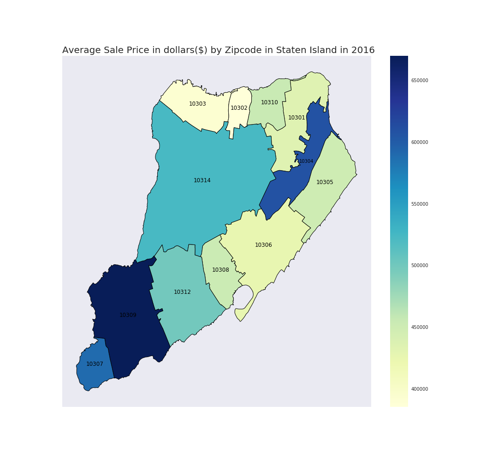

# Homework 11 submissions 
(NOTE: 72 HRS extension was approved by Professor Bianco)

## Assigment 1 (ks5063, ss12513 and mp4515)
* mp4515:
	* All combined Time-Series (unit and log10) were visualized.
	* Siginficant drop and corresponding event was detected.
* ks5063:
	* Smooth Fractional Change max and min was visualized and identified.
	* Null data was removed by detecting -1 and 4 features were engineered for modelling using for loop traversal and custom dictionaries.
	* Time-Series was standardized and visualized.
	* Train and test data was defined on the 4 engineered features.
* ss12513:
	* Model was trained on 4 engineered features.
	* Feature importance and classification report was obtained.
	* Model was trained on time series.
	* Feature importance and classification report was obtained.
## Assignment 2

* The following image was created using Rolling Sales Data.
* Script is in the file "Assignment2_ss12513.ipynb".
* Improvements made :
	* Label of zipcode 10304 not visible-has been moved
  * Changed scheme of the legend to get values from 400000 onwards
  * Title of the plot has been changed
  * Color scheme has been changed to make highlight differences between zipcodes.
 

