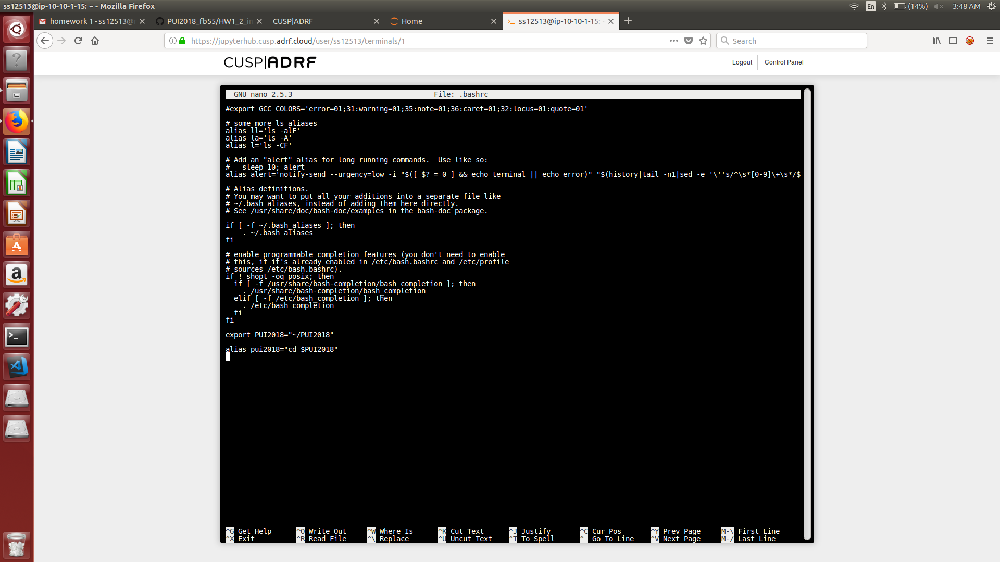
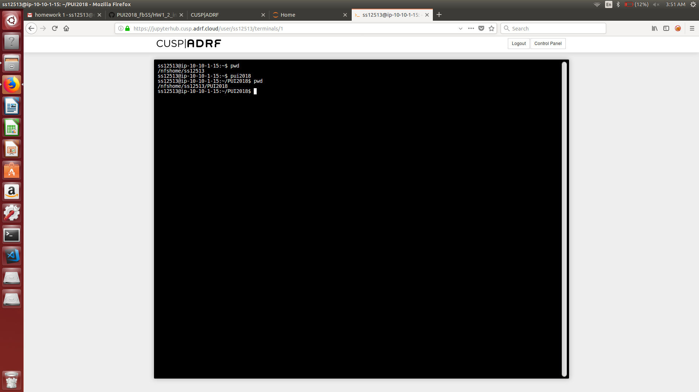

## Setting up the environment 
- Edit the .bashrc file in linux
- Append export VARNAME = "path to folder" to create an enviornment variable
- Append alias varname ="command $VARNAME" to create an alias
- Type source .bashrc to get the changes

## Screenshot 1

## Screenshot 2

