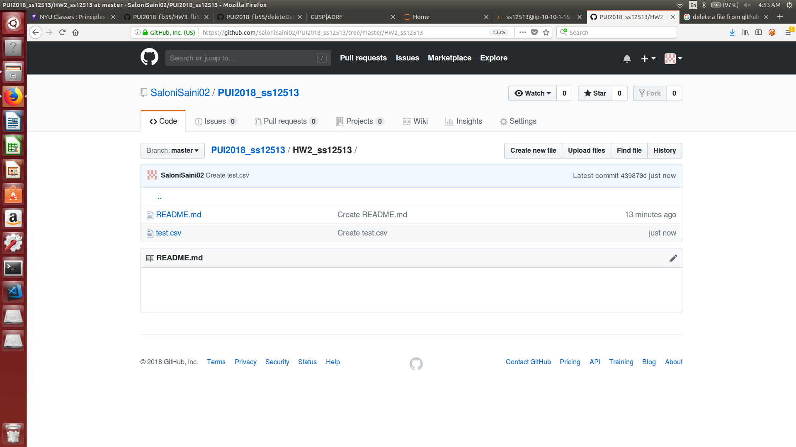
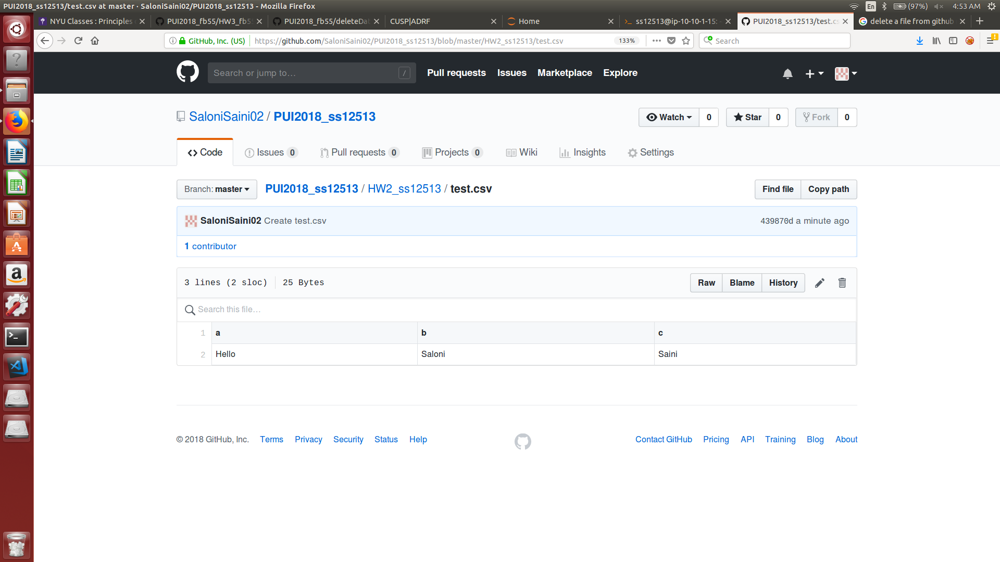
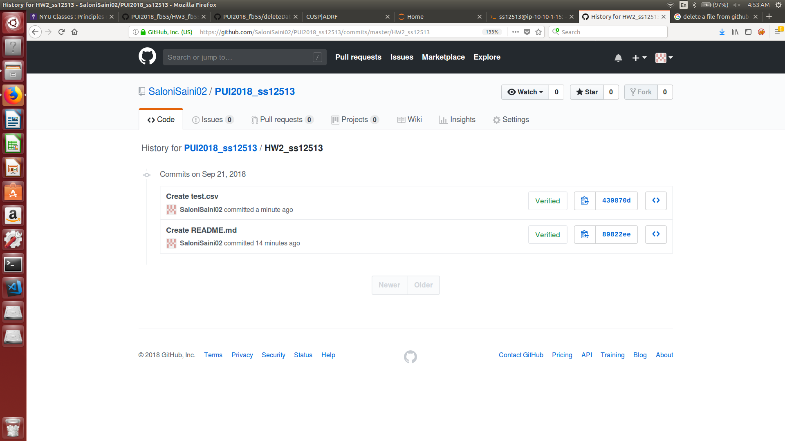
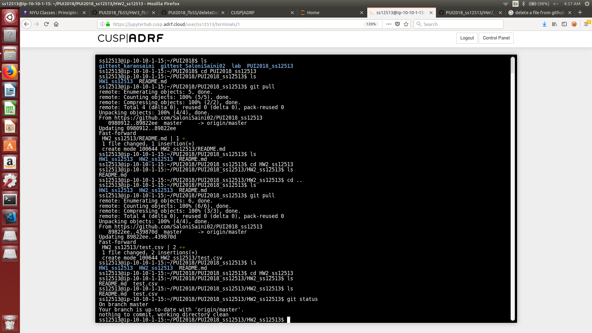
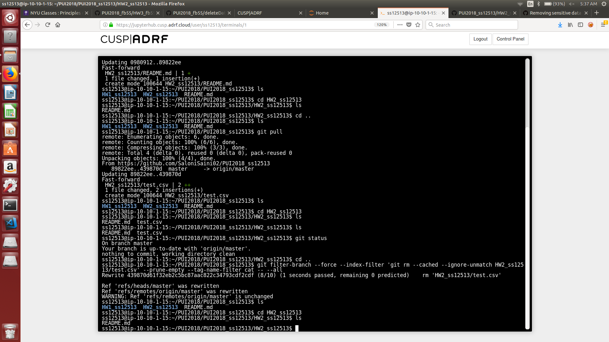
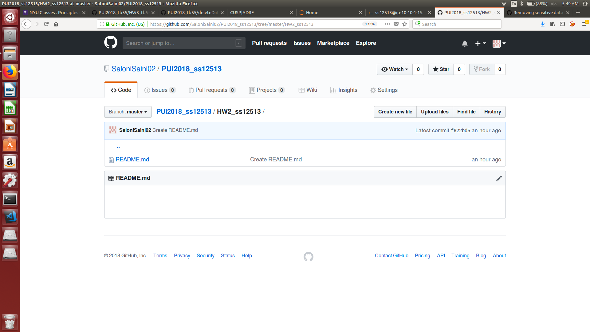
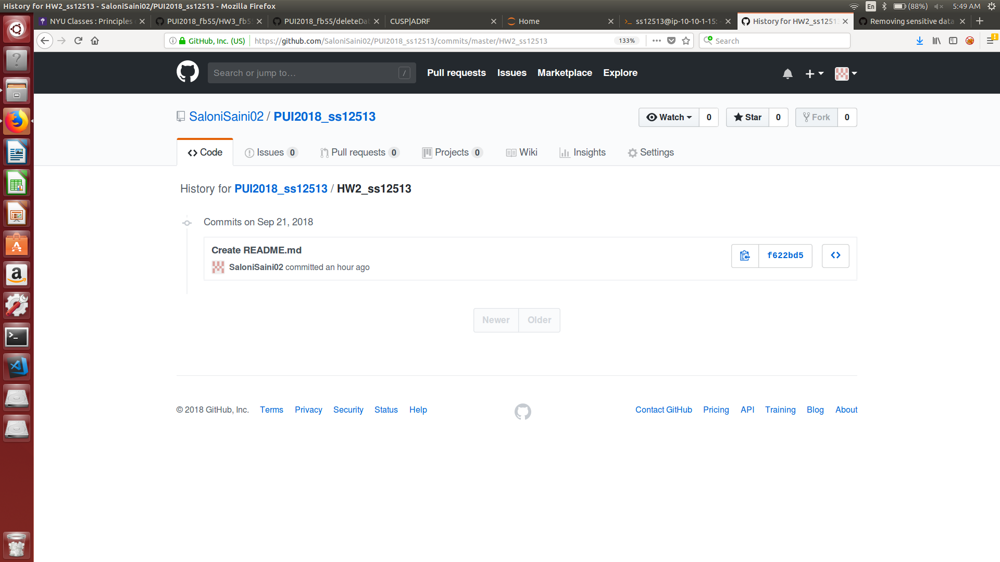

# Assignment 2
This folder contains PUI_2018 HW2 submission.

Part 1

I created test.csv in HW2_ss12513. It was deleted from the repository to illustrate how to remove sensitive data.

Part 2

- I downloaded a dataset that contains SAT scores for the year 2012.
- The CSV file is read using pandas and a plot for 2 numerical columns is rendered.
- The same dataset is read using the SODA API.
- I downloaded a dataset that conatins salt usage by the DSNY.
- The CSV file is read using pandas and a plot for the date column and numerical column is rendered.

Part 3
- Created  a python script that takes the MTA API key and a Bus line as input.
- The output is the latitude and logitude of all the buses.

Part 4
- Created  a python script that takes the MTA API key, a Bus line and file name as input.
- The output is a CSV file that contains latitude, longitude , stop name and stop status.
