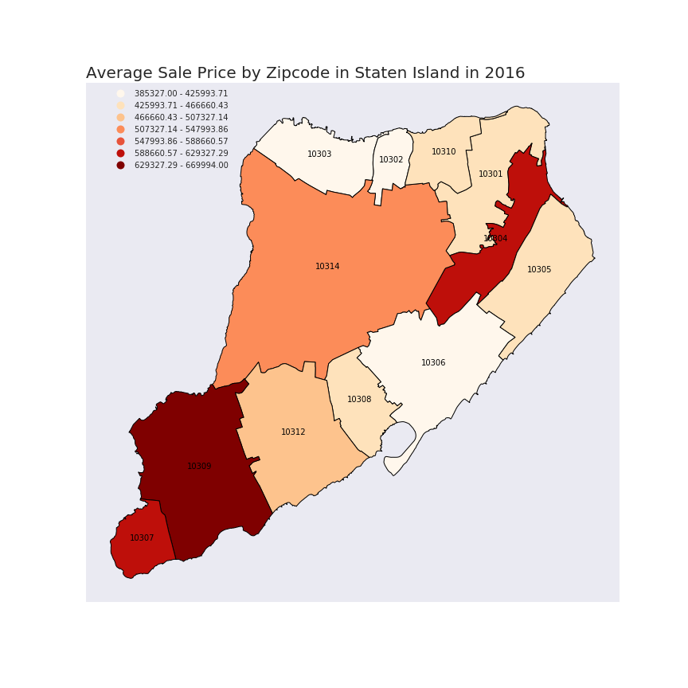

# Homework 8 submissions

## Assignment 1

* The following image was created using Rolling Sales Data from NYC Department of Finance.
* The data from Staten Island from the year 2016 is used to create the plot.
 

Figure 1: Plot of Average Sale Price of houses sold in Staten Island in the year 2016 by zipcode

## Assignment 2

* Done in collaboration with Karan Saini (ks5063).
* Authorea Article : https://www.authorea.com/users/249374/articles/335449-title
